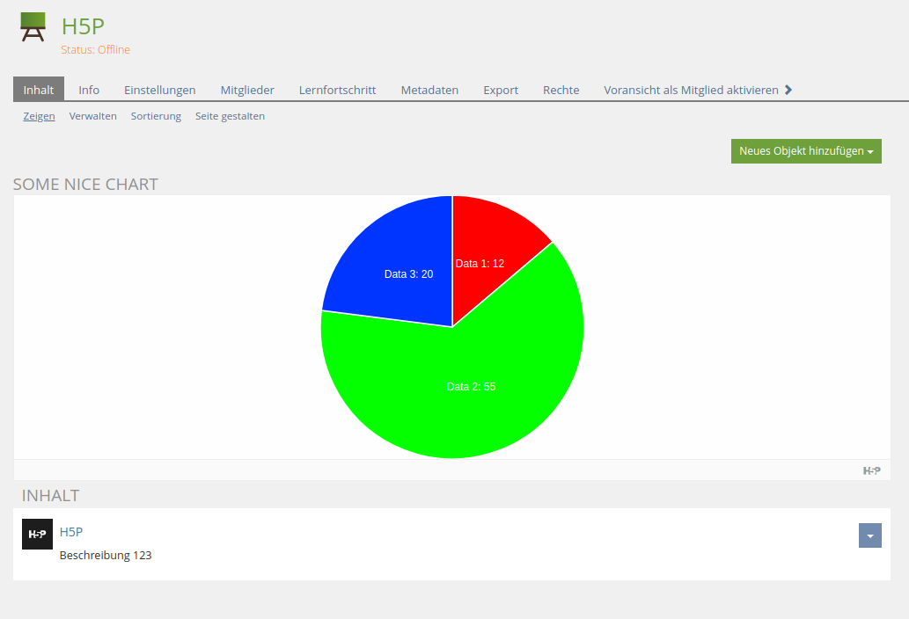

# H5PPageComponent ILIAS Plugin

Add H5P contents in page component editor

This is an OpenSource project by studer + raimann ag, CH-Burgdorf (https://studer-raimann.ch)

This project is licensed under the GPL-3.0-only license

## Requirements

* ILIAS 5.4.0 - 6.999
* PHP >=7.0

## Installation

Start at your ILIAS root directory

```bash
mkdir -p Customizing/global/plugins/Services/COPage/PageComponent
cd Customizing/global/plugins/Services/COPage/PageComponent
git clone https://github.com/studer-raimann/H5PPageComponent.git H5PPageComponent
```

Update, activate and config the plugin in the ILIAS Plugin Administration

## Description

### Base plugin

First you need to install the [H5P](https://github.com/studer-raimann/H5P) plugin

You don't need to use the repository object, if you don't wish it

### Page component editor

You can add, edit or remove H5P contents in the page component editor

You can also import H5P contents from .h5p files or export H5P contents to .h5p files

Results of H5P contents are not available



## Adjustment suggestions

You can report bugs or suggestions at https://plugins.studer-raimann.ch/goto.php?target=uihk_srsu_PLH5P

## ILIAS Plugin SLA

We love and live the philosophy of Open Source Software! Most of our developments, which we develop on behalf of customers or on our own account, are publicly available free of charge to all interested parties at https://github.com/studer-raimann.

Do you use one of our plugins professionally? Secure the timely availability of this plugin for the upcoming ILIAS versions via SLA. Please inform yourself under https://studer-raimann.ch/produkte/ilias-plugins/plugin-sla.

Please note that we only guarantee support and release maintenance for institutions that sign a SLA.
